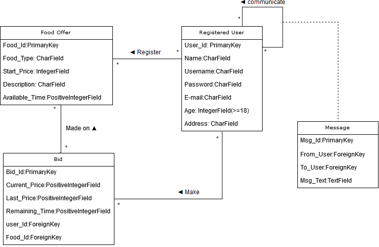

# PushEat
Recommendation applications developed using Django, including for the moment just:
    *· PushEat [models.py version 1.0](food/models.py)*
    
The project is developed using the Agile methodology.

The source code for this project is available from: https://github.com/Mrcel97/PushEat   
### Instructions to deploy and run the application.
After installing Python and Django, the recommended approach is using virtualenv.

#### - Deploy Docker

#### - Deploy Heroku

### Database Diagram (Models)

